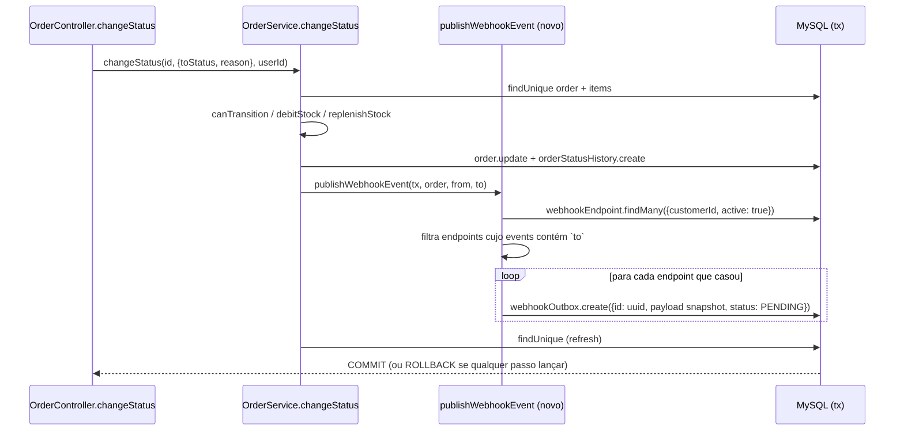

# FDD — Sistema de Webhooks de Notificação de Pedidos

| Campo | Valor |
|---|---|
| **Feature** | Webhooks de saída para mudanças de status de pedido |
| **Status** | Pronto para implementação, com pendências: contagem de envios (`RFC-OQ-06`), ordem durante o retry (`RFC-OQ-07`) e pontos de segurança (`RFC-OQ-08`) |
| **Data** | 2026-10-08 |
| **Base** | [RFC-001](RFC.md) e [ADR-001 a ADR-007](adrs/README.md) |
| **Leitores-alvo** | Bruno e Diego (implementação), Sofia (revisão de segurança), Larissa (aprovação) |

> Este documento descreve **como construir**. O porquê das escolhas está nos ADRs e não se repete aqui. Arquivos marcados **(novo)** ainda não existem, e o mesmo vale para todos os arquivos da lista "Arquivos novos" em §10, inclusive tudo o que fica sob `src/modules/webhooks/`. Todos os outros caminhos citados existem no repositório.

---

## 1. Contexto e motivação técnica

Hoje o OMS não emite nenhum evento para fora. A mudança de status acontece em `OrderService.changeStatus` (`src/modules/orders/order.service.ts`), dentro de `this.prisma.$transaction(async (tx) => ...)`. A transação segue esta ordem:

1. `tx.order.findUnique` com `items`;
2. recusa `from === to` com `ConflictError` (`INVALID_STATUS_TRANSITION`);
3. checa `canTransition(from, to)`;
4. chama `debitStock`/`replenishStock`, mas só nas transições PENDING→PAID e {PAID, PROCESSING}→CANCELLED (`src/modules/orders/order.status.ts`);
5. executa `tx.order.update`;
6. executa `tx.orderStatusHistory.create`;
7. relê o pedido com as relações.

Os clientes B2B descobrem mudanças fazendo polling em `GET /api/v1/orders` ([09:00] Marcos). A feature acrescenta um caminho de saída **assíncrono**, **atômico** com essa transação e **assinado**.

## 2. Objetivos técnicos

| ID | Objetivo | Origem |
|---|---|---|
| `FDD-OBJ-01` | Toda mudança de status com endpoint interessado gera exatamente uma linha de outbox por endpoint, na mesma transação. Se a outbox falha, o status não muda. | [09:40] Bruno, [09:41] Diego |
| `FDD-OBJ-02` | A primeira tentativa de entrega sai em até 2 s após o commit, mais o tempo da chamada HTTP. A soma fica abaixo dos 10 s de "tempo real" para um cliente saudável. | [09:02] Marcos, [09:09] Diego |
| `FDD-OBJ-03` | Nenhuma chamada HTTP dentro da transação de pedidos. | [09:04] Bruno |
| `FDD-OBJ-04` | Todo envio é assinado (HMAC-SHA256) e identificável (`X-Event-Id`, `X-Webhook-Id`). | [09:22] Sofia, [09:44] Diego, [09:44] Sofia |
| `FDD-OBJ-05` | Todo evento termina `DELIVERED` ou na DLQ, com motivo. Nenhum fica pendurado. | [09:15] Diego, [09:18] Diego |
| `FDD-OBJ-06` | Zero dependência nova de runtime e zero infraestrutura nova. | [09:07] Diego, [09:29] Bruno |

## 3. Escopo e exclusões

**Dentro do escopo:** CRUD de endpoints, rotação de secret, histórico de entregas, publicação transacional, worker com retry e DLQ, replay administrativo, assinatura e validações (https, 64 KB).

**Exclusões (não implementar):**

| ID | Exclusão | Origem |
|---|---|---|
| `FDD-EXC-01` | Webhooks de entrada (o cliente enviando para nós) | [09:02] Marcos |
| `FDD-EXC-02` | Aviso por email ao cliente quando o webhook falha | [09:37] Larissa |
| `FDD-EXC-03` | Rate limiting de saída. A decisão é observar antes. | [09:39] Larissa |
| `FDD-EXC-04` | Dashboard ou painel visual | [09:40] Larissa |
| `FDD-EXC-05` | Arquivamento das linhas entregues (~30 dias) | [09:08] Diego |
| `FDD-EXC-06` | Vários workers em paralelo e ordem global | [09:13] Diego, [09:13] Larissa |
| `FDD-EXC-07` | `items` do pedido no payload | [09:43] Diego |
| `FDD-EXC-08` | Evento na **criação** do pedido. `OrderService.create` grava o histórico inicial com `fromStatus: null` fora de `changeStatus`, e a reunião tratou só `changeStatus` como ponto de integração. | [09:40] Bruno + `src/modules/orders/order.service.ts` |
| `FDD-EXC-09` | Endpoint para **listar** a DLQ. Ninguém pediu. Até existir, o ADMIN encontra o `id` a reprocessar consultando a tabela `webhook_dead_letter`. | [09:18] Diego (só o replay foi pedido) |

## 4. Modelo de dados

O modelo segue as convenções de `prisma/schema.prisma`: ids `String @id @default(uuid()) @db.Char(36)` ([09:51] Larissa), `createdAt`/`updatedAt` e `@@map` em snake_case. A migration nova é gerada com `npm run db:migrate` (`prisma migrate dev`) dentro de `prisma/migrations/`.

```prisma
enum WebhookOutboxStatus {
  PENDING      // pendente: aguardando envio ou próxima retentativa
  PROCESSING   // processando: reservado pelo worker
  DELIVERED    // entregue
  FAILED       // falhou: terminal, copiado para webhook_dead_letter
}

model WebhookEndpoint {                      // configuração ([09:21] Bruno/Sofia)
  id                      String   @id @default(uuid()) @db.Char(36)
  customerId              String   @db.Char(36)
  url                     String   @db.VarChar(2048)
  secret                  String   @db.VarChar(128)
  previousSecret          String?  @db.VarChar(128)
  previousSecretExpiresAt DateTime?
  events                  Json     // OrderStatus[]: filtro de status ([09:33] Marcos)
  active                  Boolean  @default(true)
  createdAt               DateTime @default(now())
  updatedAt               DateTime @updatedAt

  customer    Customer            @relation(fields: [customerId], references: [id], onDelete: Cascade)
  outbox      WebhookOutbox[]
  deliveries  WebhookDelivery[]

  @@index([customerId, active])
  @@map("webhook_endpoints")
}

model WebhookOutbox {                        // ([09:06] Diego)
  id                String              @id @default(uuid()) @db.Char(36) // = event_id / X-Event-Id
  webhookEndpointId String              @db.Char(36)
  orderId           String              @db.Char(36) // sem FK: o snapshot sobrevive à remoção do pedido
  eventType         String              @db.VarChar(64)
  payload           Json                // snapshot renderizado na inserção (ADR-007)
  status            WebhookOutboxStatus @default(PENDING)
  attempts          Int                 @default(0) // envios que falharam
  nextAttemptAt     DateTime            @default(now())
  lastError         String?             @db.VarChar(500)
  deliveredAt       DateTime?
  createdAt         DateTime            @default(now())
  updatedAt         DateTime            @updatedAt

  endpoint   WebhookEndpoint     @relation(fields: [webhookEndpointId], references: [id], onDelete: Cascade)
  deliveries WebhookDelivery[]

  @@index([status, nextAttemptAt])
  @@index([createdAt])
  @@index([orderId])
  @@map("webhook_outbox")
}

model WebhookDelivery {                      // histórico ([09:34] Marcos)
  id                String   @id @default(uuid()) @db.Char(36)
  outboxId          String   @db.Char(36)
  webhookEndpointId String   @db.Char(36)
  attemptNumber     Int
  success           Boolean
  responseStatus    Int?
  responseBody      String?  @db.Text   // truncado em 65.535 bytes (limite do TEXT no MySQL)
  durationMs        Int
  errorCode         String?  @db.VarChar(64)
  createdAt         DateTime @default(now())

  outbox   WebhookOutbox   @relation(fields: [outboxId], references: [id], onDelete: Cascade)
  endpoint WebhookEndpoint @relation(fields: [webhookEndpointId], references: [id], onDelete: Cascade)

  @@index([webhookEndpointId, createdAt])
  @@map("webhook_deliveries")
}

model WebhookDeadLetter {                    // DLQ ([09:18] Diego)
  id                String    @id @default(uuid()) @db.Char(36)
  outboxId          String    @db.Char(36)       // sem FK, pelo mesmo motivo
  webhookEndpointId String    @db.Char(36)       // sem FK: a DLQ sobrevive à remoção do endpoint
  payload           Json
  reason            String    @db.VarChar(64)   // código WEBHOOK_* (§8)
  lastError         String?   @db.VarChar(500)
  attempts          Int
  failedAt          DateTime  @default(now())
  replayedAt        DateTime?
  replayedById      String?   @db.Char(36)      // auditoria ([09:36] Sofia)

  replayedBy User?           @relation("DeadLetterReplayedBy", fields: [replayedById], references: [id])

  @@index([outboxId])
  @@index([failedAt])
  @@map("webhook_dead_letter")
}
```

Notas de modelagem:

- `FDD-DADOS-01`: a outbox **tem índice em `status` e em `created_at`**, como combinado ([09:08] Diego). A consulta do worker filtra por `status` e `nextAttemptAt` e ordena por `createdAt`. Por isso o índice de `status` é composto com `nextAttemptAt`.
- `FDD-DADOS-02`: o `id` da linha da outbox **é** o `event_id`, o UUID gerado quando o evento entra na outbox ([09:25] Diego). Cada endpoint interessado recebe uma linha e, portanto, um `event_id` próprio.
- `FDD-DADOS-03` (proposta deste FDD): os relacionamentos inversos `Customer.webhookEndpoints` e `User.deadLettersReplayed` são acrescentados aos modelos existentes. A política de remoção é esta:
  - Endpoint → outbox e histórico: `onDelete: Cascade`, como `OrderItem → Order` no schema. Remover um endpoint descarta as entregas pendentes e o histórico dele, que deixa de ser consultável pela API.
  - `webhook_dead_letter`: **sem FK** para endpoint e outbox. A DLQ continua existindo depois da remoção como evidência de debug ([09:18] Diego), junto com o registro de auditoria `replayedById` ([09:36] Sofia).
  - Customer → endpoint: `onDelete: Cascade`. Sem isso, a relação obrigatória viraria `Restrict` (padrão do Prisma), e `DELETE /api/v1/customers/:id` (`src/modules/customers/customer.service.ts`) passaria a falhar com P2003, que o `errorMiddleware` não trata (responderia 500). O cascade mantém o contrato atual dessa rota.
- `FDD-DADOS-04`: a `secret` fica em coluna própria e **nunca sai em respostas de leitura**. Ela só aparece na criação e na rotação. Cifrar em repouso está pendente de revisão (§13, `FDD-RISK-04`).

## 5. Fluxos detalhados

### 5.1 `FDD-FLUXO-01` — Criação do evento na outbox (API, dentro da transação)



1. `publishWebhookEvent(tx: Prisma.TransactionClient, order: Order, fromStatus: OrderStatus, toStatus: OrderStatus): Promise<void>` mora em `src/modules/webhooks/webhook.publisher.ts` **(novo)** ([09:41] Bruno).
2. Busca os endpoints com `customerId = order.customerId` e `active = true`. O filtro por `events` contendo `toStatus` é aplicado em memória, porque a lista por customer é pequena.
3. Se nenhum endpoint casou, **nada é inserido** ([09:34] Bruno).
4. Para cada endpoint, grava uma linha. Uma linha por endpoint é derivação do filtro por endpoint ([09:34] Bruno). Gera `eventId = uuidv4()` (pacote `uuid`, já declarado em `package.json`) e renderiza o snapshot (§6.8). Depois chama `tx.webhookOutbox.create` com `id: eventId`, `status: PENDING`, `attempts: 0` e `nextAttemptAt: now`.
5. Qualquer exceção propaga, e o `$transaction` faz rollback de tudo: status, histórico, estoque e outbox ([09:40] Bruno). O `errorMiddleware` traduz o erro como já faz hoje: falha de banco não mapeada sai como `500 INTERNAL_SERVER_ERROR`, com log `Unhandled error in request`.
6. Nada é logado dentro da transação. Um log ali registraria eventos que podem sofrer rollback. A evidência do enfileiramento é a própria linha da outbox, e o worker loga quando a reserva (§5.2).
7. O payload **não** é validado contra o limite de 64 KB aqui. Essa checagem acontece no envio (§5.2). Se acontecesse aqui, um payload inválido bloquearia a mudança de status.

### 5.2 `FDD-FLUXO-02` — Processamento pelo worker

Processo: `src/worker.ts` **(novo)**, iniciado por `npm run worker` ([09:11] Larissa). Importa o `prisma` de `src/config/database.ts`. Como esse módulo instancia o client no carregamento (`createPrismaClient()`), o worker fica com uma instância própria do seu processo, apontando para a mesma `DATABASE_URL` ([09:30] Bruno).

```
boot:
  logger.info({pollIntervalMs, batchSize, recoveredProcessing}, 'webhook_worker_started')
  recover: UPDATE webhook_outbox SET status=PENDING WHERE status=PROCESSING   -- single-worker (ADR-002)
loop a cada WEBHOOK_POLL_INTERVAL_MS (2000):
  lote = SELECT ... WHERE status=PENDING AND next_attempt_at <= now()
         ORDER BY created_at ASC LIMIT WEBHOOK_WORKER_BATCH_SIZE
  UPDATE ... SET status=PROCESSING WHERE id IN (lote) AND status=PENDING
  logger.info({eventId, webhookId, orderId, attempt}, 'webhook_event_claimed')   -- por evento
  para cada evento do lote, em sequência (preserva created_at):
     endpoint = carregar(evento.webhookEndpointId)
     se endpoint inativo            -> DLQ(WEBHOOK_ENDPOINT_INACTIVE)  ; próximo
     se endpoint sem secret         -> DLQ(WEBHOOK_SECRET_REQUIRED)    ; próximo
     body = JSON.stringify(evento.payload)
     se bytes(body) > 65536         -> DLQ(WEBHOOK_PAYLOAD_TOO_LARGE)  ; próximo   ([09:24] Larissa)
     headers = assinar(body, endpoint)                                 (§6.9)
     resposta = fetch(url, POST, body, headers, timeout 10s, redirect: 'manual')
     gravar webhook_deliveries (attemptNumber = attempts+1, status, corpo, durationMs, errorCode)
     se 2xx -> status=DELIVERED, deliveredAt=now
     senão  -> FDD-FLUXO-03
  logger.info({claimed, delivered, retried, deadLettered, cycleMs}, 'webhook_worker_cycle')
```

- `FDD-FLUXO-02a`: o lote é processado **em sequência**, na ordem de `created_at` ([09:12] Diego). O tamanho do lote ("batch pequeno", [09:08] Diego) não foi fixado na reunião. Ele vira o parâmetro `WEBHOOK_WORKER_BATCH_SIZE`, com padrão inicial 10, a calibrar. Consequência do envio sequencial: um endpoint lento ocupa até 10 s **por evento**. Um lote inteiro de eventos para endpoints lentos pode atrasar em até `BATCH_SIZE × 10 s` os eventos de outros clientes (ver `FDD-RISK-09`).
- `FDD-FLUXO-02b`: a recuperação de `PROCESSING` no boot só é segura porque há um único worker ([09:12] Diego). Ela pode reenviar um evento que já tinha sido entregue antes da queda, o que é aceitável pelo at-least-once ([ADR-005](adrs/ADR-005-at-least-once-com-x-event-id.md)).
- `FDD-FLUXO-02c`: shutdown gracioso. Em `SIGINT`/`SIGTERM`, o worker para de buscar lotes, termina o evento em curso e executa `prisma.$disconnect()`, como `src/server.ts` já faz.

### 5.3 `FDD-FLUXO-03` — Retry com backoff

O backoff é exponencial, com cinco intervalos ([09:17] Larissa). `attempts` conta os envios que falharam. A leitura adotada (1 envio inicial + 5 retentativas) está justificada no [ADR-003](adrs/ADR-003-retry-backoff-exponencial-e-dlq.md) e marcada para confirmação em `RFC-OQ-06`.

| Envio | Quando | Se falhar |
|---|---|---|
| 1 (inicial) | próximo ciclo após o commit (≤ 2 s) | `attempts=1`, `nextAttemptAt = now + 1 min` |
| 2 | +1 min | `attempts=2`, `+5 min` |
| 3 | +5 min | `attempts=3`, `+30 min` |
| 4 | +30 min | `attempts=4`, `+2 h` |
| 5 | +2 h | `attempts=5`, `+12 h` |
| 6 | +12 h | `attempts=6` → **DLQ** (`WEBHOOK_MAX_ATTEMPTS_EXCEEDED`) |

A falha é marcada de volta como `status=PENDING`, com `lastError` preenchido. As constantes ficam em `src/modules/webhooks/webhook.processor.ts` **(novo)**, como `RETRY_DELAYS_MS = [60_000, 300_000, 1_800_000, 7_200_000, 43_200_000]`.

### 5.4 `FDD-FLUXO-04` — DLQ

Uma transação faz duas operações:

1. `webhookOutbox.update({status: FAILED, lastError})`;
2. `webhookDeadLetter.create({outboxId, webhookEndpointId, payload, reason, lastError, attempts})` ([09:18] Diego).

Depois do commit, o worker registra `logger.warn({eventId, webhookId, reason, attempts}, 'webhook_dead_lettered')`.

Os motivos que vão direto para a DLQ, sem retry, são `WEBHOOK_PAYLOAD_TOO_LARGE`, `WEBHOOK_ENDPOINT_INACTIVE` e `WEBHOOK_SECRET_REQUIRED`. Retentar não muda o resultado nesses casos.

### 5.5 `FDD-FLUXO-05` — Replay manual da DLQ

Rota: `POST /api/v1/admin/webhooks/dead-letter/:id/replay`, com `authenticate` e `requireRole('ADMIN')` ([09:36] Larissa). Tudo acontece numa transação:

1. Carrega a linha da DLQ (dentro da transação, passos 1 a 4). Se não existe, responde 404 `WEBHOOK_DEAD_LETTER_NOT_FOUND`. Se `replayedAt` já está preenchido, responde 409 `WEBHOOK_DEAD_LETTER_ALREADY_REPLAYED`.
2. Se o endpoint está inativo ou foi removido (a linha da outbox não existe mais), responde 409 `WEBHOOK_ENDPOINT_INACTIVE`, porque não há para onde reenviar.
3. Executa `webhookOutbox.update({status: PENDING, attempts: 0, nextAttemptAt: now, lastError: null})`. **É a mesma linha**, com o mesmo `event_id`, e por isso o cliente consegue deduplicar ([09:18] Diego, [ADR-005](adrs/ADR-005-at-least-once-com-x-event-id.md)).
4. Executa `webhookDeadLetter.update({replayedAt: now, replayedById: req.user.id})`.
5. Depois do commit, registra `logger.info({deadLetterId, eventId, webhookId, userId}, 'webhook_dead_letter_replayed')`. É o log de auditoria de quem fez o replay ([09:36] Sofia). O `replayedById` persistido no passo 4 também guarda essa informação.

### 5.6 `FDD-FLUXO-06` — Rotação de secret

Rota: `POST /api/v1/webhooks/:id/rotate-secret` ([09:21] Sofia). Numa transação, executa `previousSecret = secret`, `previousSecretExpiresAt = now + 24h` e `secret = novaSecret`. A nova secret é devolvida uma única vez. Proposta deste FDD, a validar com a Sofia: **uma nova rotação é recusada enquanto a carência anterior estiver ativa** (409 `WEBHOOK_SECRET_ROTATION_IN_PROGRESS`). O motivo é que só se guarda uma secret anterior, e aceitar a rotação invalidaria essa secret antes das 24 h prometidas ([09:21] Sofia).

A geração da secret usa `crypto.randomBytes(32).toString('hex')` (módulo nativo do Node). Ela passa pela revisão da Sofia ([09:46] Sofia).

## 6. Contratos públicos

Convenções herdadas do código:

- Prefixo `/api/v1` (`src/app.ts`).
- `Authorization: Bearer <JWT>` obrigatório (`authenticate`, `src/middlewares/auth.middleware.ts`).
- Corpo JSON.
- Erros no envelope `{"error": {"code", "message", "details?"}}` (`src/middlewares/error.middleware.ts`).
- Listas no formato `{"data": [...], "pagination": {...}}` (`src/shared/http/response.ts`).

O `customerId` vai **no path** na criação e na listagem (`/api/v1/customers/:customerId/webhooks`). A reunião permitiu body ou path ([09:32] Larissa). Escolhemos path porque a listagem "os webhooks de um customer" ([09:33] Bruno) é um GET, que não tem body. As demais operações usam `/api/v1/webhooks/:id`, no formato citado na reunião para o histórico ([09:34] Marcos). O `customerId` **não vem do JWT**, que identifica o operador, não o cliente ([09:32] Bruno).

Valores aceitos em `events`: `PAID`, `PROCESSING`, `SHIPPED`, `DELIVERED` e `CANCELLED`. `PENDING` fica de fora porque nenhuma transição de `src/modules/orders/order.status.ts` termina em `PENDING`, e um filtro nele nunca dispararia.

### 6.1 `FDD-CONTRATO-01` — Criar endpoint · `POST /api/v1/customers/:customerId/webhooks`

Origem: [09:31] Marcos.

```http
POST /api/v1/customers/6f1c2b8e-3d4a-4e5f-9a6b-7c8d9e0f1a2b/webhooks
Authorization: Bearer eyJhbGciOi...
Content-Type: application/json

{
  "url": "https://hooks.atlascomercial.com.br/oms",
  "events": ["SHIPPED", "DELIVERED"],
  "active": true
}
```

```http
HTTP/1.1 201 Created

{
  "id": "0b7e4c1a-9f3d-4a2b-8c5e-1d2f3a4b5c6d",
  "customerId": "6f1c2b8e-3d4a-4e5f-9a6b-7c8d9e0f1a2b",
  "url": "https://hooks.atlascomercial.com.br/oms",
  "events": ["SHIPPED", "DELIVERED"],
  "active": true,
  "secret": "9c1e5f0a7b3d...64 caracteres hex",
  "createdAt": "2026-10-08T12:00:00.000Z",
  "updatedAt": "2026-10-08T12:00:00.000Z"
}
```

| Status | Quando |
|---|---|
| 201 | Criado. A `secret` aparece **somente** nesta resposta e na rotação. |
| 400 `VALIDATION_ERROR` | Body inválido. Detalhes `WEBHOOK_INVALID_URL` (não é `https`) e `WEBHOOK_INVALID_EVENT_FILTER` (lista vazia ou status inválido). |
| 401 `UNAUTHORIZED` | Sem JWT ou JWT inválido. |
| 400 `VALIDATION_ERROR` | `customerId` do path não é UUID. |
| 404 `WEBHOOK_CUSTOMER_NOT_FOUND` | `customerId` inexistente. |

### 6.2 `FDD-CONTRATO-02` — Listar endpoints de um customer · `GET /api/v1/customers/:customerId/webhooks`

Origem: [09:33] Bruno.

```http
GET /api/v1/customers/6f1c2b8e-3d4a-4e5f-9a6b-7c8d9e0f1a2b/webhooks?page=1&pageSize=20
Authorization: Bearer eyJhbGciOi...
```

```http
HTTP/1.1 200 OK

{
  "data": [
    {
      "id": "0b7e4c1a-9f3d-4a2b-8c5e-1d2f3a4b5c6d",
      "customerId": "6f1c2b8e-3d4a-4e5f-9a6b-7c8d9e0f1a2b",
      "url": "https://hooks.atlascomercial.com.br/oms",
      "events": ["SHIPPED", "DELIVERED"],
      "active": true,
      "previousSecretExpiresAt": null,
      "createdAt": "2026-10-08T12:00:00.000Z",
      "updatedAt": "2026-10-08T12:00:00.000Z"
    }
  ],
  "pagination": { "page": 1, "pageSize": 20, "total": 1, "totalPages": 1 }
}
```

| Status | Quando |
|---|---|
| 200 | Lista paginada, **sem** `secret`. |
| 400 `VALIDATION_ERROR` | `customerId` não é UUID; `pageSize` > 100. |
| 404 `WEBHOOK_CUSTOMER_NOT_FOUND` | `customerId` inexistente. |
| 401 `UNAUTHORIZED` | Sem JWT. |

### 6.3 `FDD-CONTRATO-03` — Editar endpoint · `PATCH /api/v1/webhooks/:id`

Origem: [09:33] Bruno.

```http
PATCH /api/v1/webhooks/0b7e4c1a-9f3d-4a2b-8c5e-1d2f3a4b5c6d
Authorization: Bearer eyJhbGciOi...
Content-Type: application/json

{ "events": ["PAID", "SHIPPED", "DELIVERED", "CANCELLED"], "active": false }
```

```http
HTTP/1.1 200 OK

{
  "id": "0b7e4c1a-9f3d-4a2b-8c5e-1d2f3a4b5c6d",
  "customerId": "6f1c2b8e-3d4a-4e5f-9a6b-7c8d9e0f1a2b",
  "url": "https://hooks.atlascomercial.com.br/oms",
  "events": ["PAID", "SHIPPED", "DELIVERED", "CANCELLED"],
  "active": false,
  "previousSecretExpiresAt": null,
  "createdAt": "2026-10-08T12:00:00.000Z",
  "updatedAt": "2026-10-08T12:30:00.000Z"
}
```

Campos editáveis: `url`, `events` e `active`. `customerId` e `secret` não são editáveis por aqui. A mudança vale **para eventos futuros** ([ADR-007](adrs/ADR-007-snapshot-do-payload-e-filtro-na-insercao.md)).

| Status | Quando |
|---|---|
| 200 | Atualizado, sem `secret`. |
| 400 `VALIDATION_ERROR` | Mesmos detalhes do POST. |
| 401 `UNAUTHORIZED` | Sem JWT. |
| 404 `WEBHOOK_NOT_FOUND` | `id` inexistente. |

### 6.4 `FDD-CONTRATO-04` — Remover endpoint · `DELETE /api/v1/webhooks/:id`

Origem: [09:33] Bruno.

```http
DELETE /api/v1/webhooks/0b7e4c1a-9f3d-4a2b-8c5e-1d2f3a4b5c6d
Authorization: Bearer eyJhbGciOi...
```

```http
HTTP/1.1 204 No Content
```

| Status | Quando |
|---|---|
| 204 | Removido. Saem junto, em cascata, as entregas pendentes e o histórico. A DLQ é preservada (`FDD-DADOS-03`). |
| 401 `UNAUTHORIZED` | Sem JWT. |
| 404 `WEBHOOK_NOT_FOUND` | `id` inexistente. |

### 6.5 `FDD-CONTRATO-05` — Rotacionar secret · `POST /api/v1/webhooks/:id/rotate-secret`

Origem: [09:21] Sofia.

```http
POST /api/v1/webhooks/0b7e4c1a-9f3d-4a2b-8c5e-1d2f3a4b5c6d/rotate-secret
Authorization: Bearer eyJhbGciOi...
```

```http
HTTP/1.1 200 OK

{
  "id": "0b7e4c1a-9f3d-4a2b-8c5e-1d2f3a4b5c6d",
  "secret": "4be0a17c2d9f...64 caracteres hex",
  "previousSecretExpiresAt": "2026-10-09T12:00:00.000Z"
}
```

| Status | Quando |
|---|---|
| 200 | Nova secret emitida. A anterior vale até `previousSecretExpiresAt` (24 h). |
| 401 `UNAUTHORIZED` | Sem JWT. |
| 404 `WEBHOOK_NOT_FOUND` | `id` inexistente. |
| 409 `WEBHOOK_SECRET_ROTATION_IN_PROGRESS` | Já existe uma carência ativa (§5.6). |

### 6.6 `FDD-CONTRATO-06` — Histórico de entregas · `GET /api/v1/webhooks/:id/deliveries?page=1&pageSize=100`

Origem: [09:34] Marcos. As entregas vêm em ordem decrescente de `createdAt`. O `pageSize` vai até 100, o mesmo teto de `listOrdersQuerySchema` (`src/modules/orders/order.schemas.ts`), e isso cobre o exemplo "últimos 100" citado na reunião.

```http
GET /api/v1/webhooks/0b7e4c1a-9f3d-4a2b-8c5e-1d2f3a4b5c6d/deliveries?page=1&pageSize=100
Authorization: Bearer eyJhbGciOi...
```

```http
HTTP/1.1 200 OK

{
  "data": [
    {
      "id": "a1b2c3d4-0000-4000-8000-000000000001",
      "eventId": "3f9a7c52-1e4b-4d8a-b6f0-2c7e9d1a5b34",
      "attemptNumber": 2,
      "success": true,
      "responseStatus": 200,
      "responseBody": "{\"received\":true}",
      "durationMs": 184,
      "errorCode": null,
      "payload": { "event_id": "3f9a7c52-1e4b-4d8a-b6f0-2c7e9d1a5b34", "event_type": "order.status_changed", "...": "..." },
      "createdAt": "2026-10-08T12:01:03.120Z"
    },
    {
      "id": "a1b2c3d4-0000-4000-8000-000000000000",
      "eventId": "3f9a7c52-1e4b-4d8a-b6f0-2c7e9d1a5b34",
      "attemptNumber": 1,
      "success": false,
      "responseStatus": null,
      "responseBody": null,
      "durationMs": 10000,
      "errorCode": "WEBHOOK_DELIVERY_TIMEOUT",
      "payload": { "...": "..." },
      "createdAt": "2026-10-08T12:00:02.050Z"
    }
  ],
  "pagination": { "page": 1, "pageSize": 100, "total": 2, "totalPages": 1 }
}
```

| Status | Quando |
|---|---|
| 200 | Histórico com sucesso ou falha, payload, resposta e tempo de resposta. |
| 400 `VALIDATION_ERROR` | `pageSize` > 100. |
| 401 `UNAUTHORIZED` | Sem JWT. |
| 404 `WEBHOOK_NOT_FOUND` | `id` inexistente. |

### 6.7 `FDD-CONTRATO-07` — Replay da DLQ · `POST /api/v1/admin/webhooks/dead-letter/:id/replay`

Origem: [09:18] Diego e [09:36] Sofia.

```http
POST /api/v1/admin/webhooks/dead-letter/7d6c5b4a-3e2f-4a1b-9c8d-0e1f2a3b4c5d/replay
Authorization: Bearer <JWT de usuário ADMIN>
```

```http
HTTP/1.1 202 Accepted

{
  "deadLetterId": "7d6c5b4a-3e2f-4a1b-9c8d-0e1f2a3b4c5d",
  "eventId": "3f9a7c52-1e4b-4d8a-b6f0-2c7e9d1a5b34",
  "status": "PENDING",
  "replayedAt": "2026-10-09T08:15:00.000Z",
  "replayedById": "c0ffee00-1111-4222-8333-444455556666"
}
```

A resposta é `202`, porque a entrega acontece depois, no worker.

| Status | Quando |
|---|---|
| 202 | Evento recolocado na outbox como `PENDING`. |
| 401 `UNAUTHORIZED` | Sem JWT. |
| 403 `FORBIDDEN` | O usuário não é `ADMIN`. O código vem do `requireRole` existente. |
| 404 `WEBHOOK_DEAD_LETTER_NOT_FOUND` | `id` inexistente. |
| 409 `WEBHOOK_DEAD_LETTER_ALREADY_REPLAYED` | O item já foi reprocessado. |
| 409 `WEBHOOK_ENDPOINT_INACTIVE` | O endpoint está desativado (é preciso reativá-lo antes) ou foi removido. |

### 6.8 `FDD-CONTRATO-08` — Chamada de saída para o cliente (o webhook em si)

Origem: [09:43] Diego, [09:44] Diego e [09:44] Sofia.

```http
POST https://hooks.atlascomercial.com.br/oms
Content-Type: application/json
X-Event-Id: 3f9a7c52-1e4b-4d8a-b6f0-2c7e9d1a5b34
X-Webhook-Id: 0b7e4c1a-9f3d-4a2b-8c5e-1d2f3a4b5c6d
X-Timestamp: 2026-10-08T12:00:02.000Z
X-Signature: sha256=5d41402abc4b2a76b9719d911017c592...

{
  "event_id": "3f9a7c52-1e4b-4d8a-b6f0-2c7e9d1a5b34",
  "event_type": "order.status_changed",
  "timestamp": "2026-10-08T12:00:00.512Z",
  "order_id": "9a8b7c6d-5e4f-4a3b-8c2d-1e0f9a8b7c6d",
  "order_number": "ORD-000123",
  "from_status": "PROCESSING",
  "to_status": "SHIPPED",
  "customer_id": "6f1c2b8e-3d4a-4e5f-9a6b-7c8d9e0f1a2b",
  "total_cents": 18000
}
```

- `timestamp` (no corpo) é o instante da mudança de status, gravado no snapshot. `X-Timestamp` (no header) é o instante **deste envio** ([09:44] Diego). Os dois diferem em retentativas.
- O snapshot do payload é decidido no [ADR-007](adrs/ADR-007-snapshot-do-payload-e-filtro-na-insercao.md). Os campos vêm de `Order` (`id`, `orderNumber`, `customerId`, `totalCents`, em `prisma/schema.prisma`), convertidos para snake_case no payload.
- **Resposta esperada do cliente:** qualquer `2xx` em até 10 s significa entregue. O corpo da resposta é guardado no histórico, truncado.

### 6.9 `FDD-CONTRATO-09` — Assinatura

- `signature = hex(HMAC_SHA256(key = secret, message = corpo bruto em UTF-8))` ([09:22] Sofia).
- Formato do header: `X-Signature: sha256=<hex>`. Durante a carência de rotação, o header leva `sha256=<hex com a secret nova>,sha256=<hex com a secret anterior>`. O cliente aceita o envio se **qualquer uma** bater, com comparação de tempo constante.
- O formato `sha256=` e o uso de vírgula como separador são propostas deste FDD. A reunião definiu o algoritmo, o header e a carência. O formato será validado na revisão da Sofia.

## 7. Estratégias de resiliência

| ID | Aspecto | Estratégia | Origem |
|---|---|---|---|
| `FDD-RES-01` | Timeout | `fetch` com `AbortSignal.timeout(WEBHOOK_HTTP_TIMEOUT_MS = 10000)`. Estourar o tempo conta como falha retentável `WEBHOOK_DELIVERY_TIMEOUT`. | [09:42] Diego |
| `FDD-RES-02` | Critério de sucesso | Só `2xx` é sucesso. `3xx` não é seguido (`redirect: 'manual'`), para não sair do `https` validado; vira `WEBHOOK_DELIVERY_HTTP_ERROR`. `4xx`/`5xx` também retentam, porque a reunião não diferenciou. | Derivado de [09:23] Sofia (TLS) |
| `FDD-RES-03` | Retentativas | Backoff 1m/5m/30m/2h/12h e depois DLQ (§5.3). | [09:17] Larissa |
| `FDD-RES-04` | Fallback | A DLQ mais o replay manual por ADMIN são o único fallback. Não existe canal alternativo (email fora do escopo). | [09:18] Diego, [09:37] Larissa |
| `FDD-RES-05` | Isolamento | Um cliente lento nunca afeta a API, que roda em outro processo. No worker, ele consome até 10 s por evento e pode atrasar outros clientes do mesmo lote (`FDD-RISK-09`). | [09:04] Bruno, [09:11] Diego |
| `FDD-RES-06` | Queda do worker | Ao reiniciar, devolve `PROCESSING` para `PENDING` (§5.2). Um reenvio possível é coberto pelo at-least-once. | [09:24] Diego |
| `FDD-RES-07` | Banco indisponível no worker | O erro do ciclo é logado em `error` e o loop continua no próximo intervalo, sem derrubar o processo. A outbox preserva os eventos. | [09:06] Diego |
| `FDD-RES-08` | Payload acima de 64 KB | Não envia. Vai para a DLQ com `WEBHOOK_PAYLOAD_TOO_LARGE`. Não trunca. | [09:23] Sofia, [09:24] Larissa |
| `FDD-RES-09` | Falha ao publicar | Rollback da mudança de status. Nunca existe status mudado sem evento. | [09:40] Bruno |

## 8. Matriz de erros

Os erros HTTP são classes em `src/modules/webhooks/webhook.errors.ts` **(novo)**, que estendem as classes de `src/shared/errors/`.

Observação de implementação: `NotFoundError` fixa o código `NOT_FOUND` e não aceita outro. Por isso, os 404 do módulo estendem `AppError` diretamente: `super(msg, 404, 'WEBHOOK_NOT_FOUND')`. Os 409 usam `ConflictError(message, code)`, que já aceita código.

**Erros da API (respostas HTTP):**

| ID | Código | HTTP | Gatilho | Mensagem |
|---|---|---|---|---|
| `FDD-ERR-01` | `WEBHOOK_NOT_FOUND` | 404 | `:id` de endpoint inexistente (PATCH, DELETE, rotate, deliveries) | `Webhook not found` |
| `FDD-ERR-02` | `WEBHOOK_CUSTOMER_NOT_FOUND` | 404 | `customerId` inexistente no POST | `Customer not found` |
| `FDD-ERR-03` | `WEBHOOK_INVALID_URL` | 400 (em `details` de `VALIDATION_ERROR`) | URL inválida ou não `https` (refine do Zod) | `Webhook URL must use https` |
| `FDD-ERR-04` | `WEBHOOK_INVALID_EVENT_FILTER` | 400 (em `details` de `VALIDATION_ERROR`) | `events` vazio, com `PENDING` ou com status desconhecido | `events must be a non-empty list of PAID, PROCESSING, SHIPPED, DELIVERED, CANCELLED` |
| `FDD-ERR-05` | `WEBHOOK_DEAD_LETTER_NOT_FOUND` | 404 | `:id` de DLQ inexistente | `Dead letter not found` |
| `FDD-ERR-06` | `WEBHOOK_DEAD_LETTER_ALREADY_REPLAYED` | 409 | Replay de item com `replayedAt` preenchido | `Dead letter already replayed` |
| `FDD-ERR-07` | `WEBHOOK_ENDPOINT_INACTIVE` | 409 | Replay com o endpoint desativado ou removido | `Webhook endpoint is inactive` |
| `FDD-ERR-15` | `WEBHOOK_SECRET_ROTATION_IN_PROGRESS` | 409 | `rotate-secret` durante uma carência ativa (proposta, §5.6) | `Previous secret still in grace period` |

Os códigos `FDD-ERR-03` e `FDD-ERR-04` chegam dentro de `details`, e não como `code` de primeiro nível. O motivo está em `ADR-006-CONS-03` ([ADR-006](adrs/ADR-006-reuso-dos-padroes-do-projeto.md)). Exemplo:

```json
{ "error": { "code": "VALIDATION_ERROR", "message": "Validation failed",
  "details": [ { "path": "url", "message": "WEBHOOK_INVALID_URL: Webhook URL must use https" } ] } }
```

**Erros do worker** (gravados em `webhook_deliveries.errorCode`, `webhook_dead_letter.reason` e nos logs; não são respostas HTTP):

| ID | Código | Retentável | Gatilho | Destino |
|---|---|---|---|---|
| `FDD-ERR-08` | `WEBHOOK_DELIVERY_TIMEOUT` | Sim | Sem resposta em 10 s | Backoff |
| `FDD-ERR-09` | `WEBHOOK_DELIVERY_HTTP_ERROR` | Sim | Resposta não `2xx` | Backoff |
| `FDD-ERR-10` | `WEBHOOK_DELIVERY_NETWORK_ERROR` | Sim | DNS, conexão recusada ou falha de TLS | Backoff |
| `FDD-ERR-11` | `WEBHOOK_MAX_ATTEMPTS_EXCEEDED` | — | Falha do 6º envio | DLQ |
| `FDD-ERR-12` | `WEBHOOK_PAYLOAD_TOO_LARGE` | Não | Corpo > 65.536 bytes | DLQ direto |
| `FDD-ERR-13` | `WEBHOOK_ENDPOINT_INACTIVE` | Não | Endpoint desativado depois da inserção | DLQ direto |
| `FDD-ERR-14` | `WEBHOOK_SECRET_REQUIRED` | Não | Endpoint sem secret no momento de assinar. É defensivo: a secret é sempre gerada na criação ([09:31] Marcos). | DLQ direto |

## 9. Observabilidade

O projeto não tem biblioteca de métricas nem de tracing (`package.json`), e a decisão é não acrescentar nada novo ([09:29] Bruno). A observabilidade usa o Pino de `src/shared/logger/index.ts` e consultas sobre as tabelas do módulo.

**Logs** (`FDD-OBS-01`): JSON estruturado, com mensagem em snake_case. A chamada segue a assinatura do Pino usada no projeto, objeto primeiro e mensagem depois: `logger.info({ port, env }, 'server_started')` em `src/server.ts`. O worker usa `logger.child({ component: 'webhook-worker' })`. Nada é logado dentro de transação; os logs abaixo saem depois do commit.

| Evento | Nível | Campos |
|---|---|---|
| `webhook_event_claimed` | info | `eventId`, `webhookId`, `orderId`, `attempt` |
| `webhook_worker_started` / `webhook_worker_stopped` | info | `pollIntervalMs`, `batchSize`, `recoveredProcessing` |
| `webhook_worker_cycle` | debug, ou info quando houver trabalho | `claimed`, `delivered`, `retried`, `deadLettered`, `cycleMs` |
| `webhook_delivery_succeeded` | info | `eventId`, `webhookId`, `attempt`, `statusCode`, `durationMs` |
| `webhook_delivery_failed` | warn | `eventId`, `webhookId`, `attempt`, `errorCode`, `statusCode?`, `nextAttemptAt` |
| `webhook_dead_lettered` | warn | `eventId`, `webhookId`, `reason`, `attempts` |
| `webhook_dead_letter_replayed` | info | `deadLetterId`, `eventId`, `userId` (auditoria, [09:36] Sofia) |
| `webhook_secret_rotated` | info | `webhookId`, `userId`. **Nunca** a secret. |

A redação passa a incluir `'*.secret'` e `'*.previousSecret'` em `redactPaths` ([09:22] Diego).

**Métricas** (`FDD-OBS-02`): derivadas por SQL ou pelos logs de ciclo, sem dependência nova.

| Métrica | Como medir | Alerta sugerido |
|---|---|---|
| Lag da outbox (idade do `PENDING` mais antigo já vencido) | `now() - MIN(created_at) WHERE status='PENDING' AND next_attempt_at <= now()` | > 10 s: worker parado ou lento ([09:02] Marcos) |
| Backlog | `COUNT(*) WHERE status IN ('PENDING','PROCESSING')` | Crescimento contínuo |
| Latência commit → entrega | `delivered_at - created_at` (p50/p95) dos `DELIVERED` | p95 > 10 s |
| Taxa de sucesso por endpoint | `webhook_deliveries` agrupado por `webhook_endpoint_id`, `success` | Queda abrupta em um cliente |
| DLQ aberta | `COUNT(*) FROM webhook_dead_letter WHERE replayed_at IS NULL` | > 0 |
| Duração das chamadas | `durationMs` em `webhook_deliveries` | p95 perto de 10 s |

**Tracing** (`FDD-OBS-03`): não existe tracing distribuído no projeto, e adotar OpenTelemetry não foi decidido. A rastreabilidade ponta a ponta vem de **chaves de correlação**:

- o `eventId` (= `X-Event-Id`) aparece em cada log do worker, em `webhook_deliveries`, na DLQ e no request recebido pelo cliente;
- o `orderId` liga o evento a `order_status_history` (`changedAt`, `changedById`), que diz quando e por quem a mudança foi feita;
- na API, o log `http_request` do `requestLogger` (`src/middlewares/request-logger.middleware.ts`) registra o `PATCH /api/v1/orders/:id/status` com `requestId` e `userId`. A ligação com o evento é feita por `orderId` e horário.
- Levar o `requestId` para a linha da outbox exigiria passar o id da requisição para `changeStatus`, que hoje não o recebe. Fica como melhoria possível, fora desta entrega.

## 10. Integração com o sistema existente

| ID | Arquivo (existente) | Como o módulo de webhooks se integra |
|---|---|---|
| `FDD-INT-01` | `src/modules/orders/order.service.ts` | Em `changeStatus`, depois de `tx.orderStatusHistory.create(...)` e antes do `findUnique` de refresh, entra **uma** linha: `await publishWebhookEvent(tx, order, from, to);`. O `order` é o registro já carregado no início da transação. `from` e `to` são as variáveis locais que já existem. O tipo `TxClient = Prisma.TransactionClient`, já declarado no arquivo, é o mesmo que a função recebe. Não há mudança no construtor nem em `create()` ([09:40] Bruno, [09:41] Bruno). |
| `FDD-INT-02` | `src/modules/orders/order.status.ts` | Sem alteração. A tabela `transitions` define os valores aceitos em `events`: todos os do enum `OrderStatus` (definido em `prisma/schema.prisma`), exceto `PENDING`, que não é destino de nenhuma transição. |
| `FDD-INT-03` | `prisma/schema.prisma` | Acrescenta o enum `WebhookOutboxStatus` e os modelos `WebhookEndpoint`, `WebhookOutbox`, `WebhookDelivery` e `WebhookDeadLetter` (§4). Acrescenta as relações inversas em `Customer` (com `onDelete: Cascade` no lado do endpoint) e em `User`. A migration é gerada com `npm run db:migrate`. |
| `FDD-INT-04` | `src/shared/errors/app-error.ts`, `src/shared/errors/http-errors.ts`, `src/shared/errors/index.ts` | Sem alteração. As classes `WEBHOOK_*` em `webhook.errors.ts` **(novo)** estendem `AppError` (404) e `ConflictError` (409) ([09:28] Bruno). |
| `FDD-INT-05` | `src/middlewares/error.middleware.ts` | Sem alteração. Já converte `AppError` no envelope `{error: {code, message, details}}` ([09:29] Bruno). |
| `FDD-INT-06` | `src/middlewares/validate.middleware.ts` | Sem alteração. Usado em todas as rotas novas com os schemas de `webhook.schemas.ts` **(novo)**. Impacto: os códigos de validação vão em `details` (§8). |
| `FDD-INT-07` | `src/middlewares/auth.middleware.ts` | `authenticate` em todas as rotas. `requireRole('ADMIN')` só no replay ([09:36] Larissa), como em `src/modules/users/user.routes.ts`. |
| `FDD-INT-08` | `src/routes/index.ts` | `Controllers` ganha `webhooks: WebhookController`. `buildApiRouter` registra três montagens: `router.use('/customers/:customerId/webhooks', buildCustomerWebhookRouter(...))` (com `Router({ mergeParams: true })`, registrado **antes** de `'/customers'`), `router.use('/webhooks', buildWebhookRouter(...))` e `router.use('/admin/webhooks', buildWebhookAdminRouter(...))`. |
| `FDD-INT-09` | `src/app.ts` | `buildControllers(prisma)` instancia `WebhookRepository`, `WebhookService` e `WebhookController`, como faz com orders. Nada muda no `buildApp`. |
| `FDD-INT-10` | `src/config/database.ts` | Sem alteração. `src/worker.ts` **(novo)** importa o `prisma` exportado, que é instanciado por `createPrismaClient()` no carregamento do módulo. Em outro processo, isso já é uma instância própria ([09:30] Bruno). |
| `FDD-INT-11` | `src/config/env.ts` | O `envSchema` ganha `WEBHOOK_POLL_INTERVAL_MS` (padrão `2000`), `WEBHOOK_HTTP_TIMEOUT_MS` (padrão `10000`) e `WEBHOOK_WORKER_BATCH_SIZE` (padrão `10`), todos com `z.coerce.number().int().positive()`. O `.env.example` recebe as três chaves. |
| `FDD-INT-12` | `src/shared/logger/index.ts` | `redactPaths` ganha `'*.secret'` e `'*.previousSecret'`. O worker usa o mesmo `logger` com `child`. |
| `FDD-INT-13` | `src/server.ts` | Sem alteração. É o modelo para `src/worker.ts` **(novo)**: `bootstrap()`, handlers de `SIGINT`/`SIGTERM` com `prisma.$disconnect()` e `logger.fatal` em falha de boot ([09:11] Larissa). |
| `FDD-INT-14` | `src/shared/http/response.ts` | `paginated()` nas listagens de endpoints e entregas. |
| `FDD-INT-15` | `package.json` | Novos scripts `"worker": "node --env-file=.env dist/worker.js"` (o build passa a gerar `dist/worker.js`) e `"worker:dev": "tsx watch --env-file=.env src/worker.ts"` ([09:11] Larissa). Nenhuma dependência nova: `uuid` (11.0.3) já existe, e `crypto` e `fetch` são nativos no Node ≥ 20 (`engines`). |
| `FDD-INT-16` | `tests/setup.ts`, `tests/helpers/factories.ts` | O `beforeEach` passa a apagar `webhookDelivery`, `webhookDeadLetter`, `webhookOutbox` e `webhookEndpoint` antes de `order*`, `customer` e `user`, por causa das FKs. As factories ganham `createTestWebhook(customerId, overrides)`. |
| `FDD-INT-17` | `src/modules/customers/customer.service.ts` | Sem alteração. O `delete` continua funcionando para customers com webhooks, graças ao cascade de `FDD-DADOS-03`. |
| `FDD-INT-18` | `src/modules/orders/order.routes.ts` | Sem alteração. O contrato de `PATCH /api/v1/orders/:id/status` continua o mesmo. Quem consome o webhook usa `GET /api/v1/orders/:id` para detalhes ([09:43] Diego). |

**Arquivos novos:**

- `src/worker.ts`
- `src/modules/webhooks/`, com:
  - `webhook.controller.ts`, `webhook.service.ts`, `webhook.repository.ts`, `webhook.routes.ts` e `webhook.schemas.ts` ([09:27] Bruno);
  - `webhook.admin.routes.ts`, `webhook.errors.ts`, `webhook.publisher.ts` (`publishWebhookEvent`), `webhook.processor.ts` (laço do worker, [09:28] Bruno) e `webhook.signature.ts` (HMAC);
- `tests/webhooks.test.ts` e `tests/webhook-processor.test.ts`.

## 11. Dependências e compatibilidade

- **Runtime:** Node ≥ 20 (`package.json`, `engines`), com `fetch`, `AbortSignal.timeout` e `crypto.createHmac` nativos. Prisma 5.22.0, MySQL 8.0 (`docker-compose.yml`) e Zod 3.23.8, todos já presentes. **Nenhuma dependência nova.**
- **Infraestrutura:** o mesmo MySQL, sem serviço novo no `docker-compose.yml` ([09:07] Diego). Um processo a mais em produção (`npm run worker`).
- **Compatibilidade da API:** só rotas novas. As rotas existentes mantêm o contrato, inclusive `DELETE /api/v1/customers/:id` (`FDD-DADOS-03`). `PATCH /orders/:id/status` só fica mais lento por um SELECT e N INSERTs.
- **Compatibilidade dos testes:** os testes atuais (`tests/orders.test.ts`) não criam endpoints. Com isso, `publishWebhookEvent` não insere nada, e o comportamento observado continua o mesmo.
- **Dependências organizacionais:** a revisão de segurança da Sofia, de pelo menos 2 dias úteis antes do deploy, foca em HMAC e geração de secret ([09:46] Sofia). A comunicação do contrato (at-least-once, headers) aos clientes fica com Marcos ([09:26] Marcos).

## 12. Critérios de aceite técnicos

| ID | Critério verificável |
|---|---|
| `FDD-AC-01` | `PATCH /api/v1/orders/:id/status` para um customer com endpoint ativo e `events` contendo o `toStatus` cria exatamente uma linha `PENDING` em `webhook_outbox` por endpoint, com payload igual ao §6.8. |
| `FDD-AC-02` | Se `webhookOutbox.create` lança (forçado no teste), o status do pedido, o `order_status_history` e o estoque ficam como estavam. |
| `FDD-AC-03` | Customer sem endpoint, ou com endpoint cujo filtro não contém o status: nenhuma linha é inserida. |
| `FDD-AC-04` | `POST /api/v1/customers/:customerId/webhooks` com `http://` responde 400, com `WEBHOOK_INVALID_URL` em `details`. Com `https://`, responde 201 com `secret`. `GET` nunca devolve `secret`. |
| `FDD-AC-05` | Contra um servidor de teste, o worker entrega com os headers `Content-Type`, `X-Event-Id`, `X-Webhook-Id`, `X-Timestamp` e `X-Signature`. O HMAC-SHA256 do corpo recebido, com a secret do endpoint, bate com o header. |
| `FDD-AC-06` | Um servidor que demora mais de 10 s gera `WEBHOOK_DELIVERY_TIMEOUT`, com `attempts=1` e `nextAttemptAt ≈ now+1min`. A sequência de falhas segue 1m/5m/30m/2h/12h e, na 6ª falha, a linha fica `FAILED` com registro em `webhook_dead_letter`. |
| `FDD-AC-07` | Payload > 65.536 bytes vai para a DLQ com `WEBHOOK_PAYLOAD_TOO_LARGE`, sem nenhuma chamada HTTP. |
| `FDD-AC-08` | Replay com OPERATOR responde 403. Com ADMIN, responde 202: a mesma linha da outbox volta a `PENDING` com o mesmo `id`, a DLQ registra `replayedById`, e o log `webhook_dead_letter_replayed` traz o `userId`. Um segundo replay responde 409. |
| `FDD-AC-09` | Depois de `rotate-secret`, os envios nas 24 h seguintes trazem duas assinaturas, e depois de `previousSecretExpiresAt` só uma. Uma segunda rotação dentro da carência responde 409. |
| `FDD-AC-10` | `GET /api/v1/webhooks/:id/deliveries` lista as tentativas em ordem decrescente, com `success`, `responseStatus`, `durationMs` e `payload`. `pageSize` > 100 responde 400. |
| `FDD-AC-11` | Com o worker parado, a API continua mudando status normalmente. Ao subir, o worker entrega o backlog em ordem de `created_at`. |
| `FDD-AC-12` | Nenhum log contém o valor de `secret` ou de `previousSecret`. |
| `FDD-AC-13` | `DELETE /api/v1/customers/:id` de um customer sem pedidos e com webhook responde 204, e as linhas da DLQ desse endpoint continuam no banco. |
| `FDD-AC-14` | `npm run lint`, `npm run build` e `npm test` passam, inclusive `tests/orders.test.ts` sem modificação de asserts. |

## 13. Riscos e mitigação

| ID | Risco técnico | Prob. | Impacto | Mitigação |
|---|---|---|---|---|
| `FDD-RISK-01` | Ordem por pedido quebrada quando um evento entra em backoff e o seguinte é entregue ([09:12] Diego) | Média | Médio | Limitação documentada. O payload traz `from_status`, `to_status` e `timestamp` para reconciliação. A decisão sobre bloquear por `order_id` está em `RFC-OQ-07`. |
| `FDD-RISK-02` | Reenvio duplicado (queda entre o POST e a marcação, timeout com processamento no cliente) | Média | Médio | At-least-once com `X-Event-Id` estável ([ADR-005](adrs/ADR-005-at-least-once-com-x-event-id.md)). |
| `FDD-RISK-03` | Worker parado sem ninguém perceber | Baixa | Alto | Alerta de lag > 10 s (§9). A outbox retém os eventos sem perda. |
| `FDD-RISK-04` | Secret em claro no banco (o HMAC exige o valor original) | Média | Alto | Acesso ao banco restrito, redação nos logs e secret nunca devolvida em leitura. Cifrar em repouso é pauta da revisão da Sofia ([09:46] Sofia). |
| `FDD-RISK-05` | `X-Timestamp` fora da assinatura permite replay de um corpo capturado ([09:44] Diego) | Baixa | Médio | TLS obrigatório e deduplicação por `X-Event-Id` no cliente. Também é pauta da revisão de segurança. |
| `FDD-RISK-06` | Contenção na transação de `changeStatus` por causa dos INSERTs na outbox | Baixa | Médio | Uma consulta indexada por `customerId, active` e um INSERT por endpoint. Monitorar a duração do `PATCH` pelo `http_request.durationMs` que já existe. |
| `FDD-RISK-07` | Rajada de envios para um cliente (sem rate limiting) ([09:38] Diego) | Média | Baixo | Envio sequencial em um único worker limita a concorrência a 1. Observar e decidir depois ([09:39] Larissa). |
| `FDD-RISK-09` | Head-of-line blocking: eventos para endpoints lentos (até 10 s cada) atrasam, no mesmo lote, eventos de clientes saudáveis além dos 10 s ([09:02] Marcos) | Média | Médio | Manter `WEBHOOK_WORKER_BATCH_SIZE` pequeno e acompanhar o alerta de lag > 10 s (§9). Se o problema ocorrer, ele entra na mesma decisão futura de paralelismo (`RFC-OQ-03`). |
| `FDD-RISK-08` | Qualquer usuário autenticado gerencia webhooks de qualquer customer (sem vínculo `User`→`Customer` no schema) | Média | Médio | Igual ao modelo atual de pedidos e clientes. Endurecimento previsto para depois ([09:37] Sofia). |
