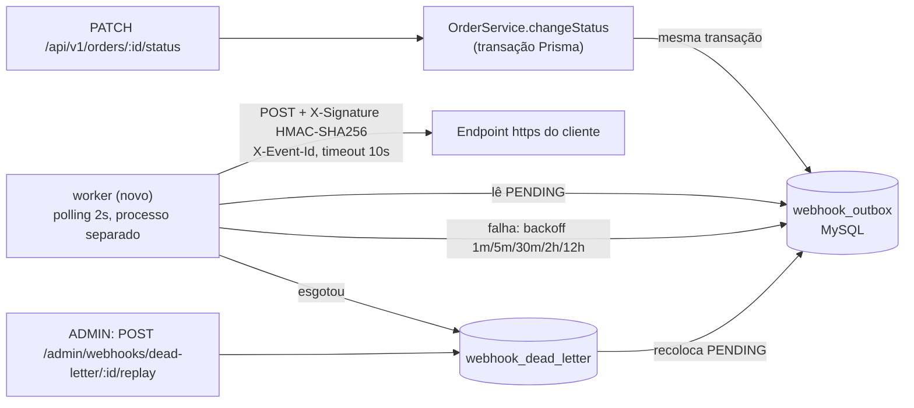

# RFC-001 — Sistema de Webhooks de Notificação de Pedidos

| Campo | Valor |
|---|---|
| **Autor** | Diego Nogueira, aluno do MBA, redator do pacote a partir da reunião conduzida por Larissa. **Não é** o participante Diego (Plataforma) listado entre os revisores. |
| **Status** | Em revisão |
| **Data** | 2026-10-08 |
| **Revisores** | Larissa (Tech Lead), Marcos (Product Manager), Bruno (Eng. Pleno, Pedidos), Diego (Eng. Sênior, Plataforma), Sofia (Eng. de Segurança) |
| **Fonte** | [`TRANSCRICAO.md`](../TRANSCRICAO.md) e o código em `src/` |
| **Documentos irmãos** | [PRD](PRD.md) (por quê e o quê), [FDD](FDD.md) (como construir), [ADRs](adrs/README.md) (decisões fechadas), [TRACKER](TRACKER.md) (de onde veio cada item) |

## 1. Resumo executivo (TL;DR)

`RFC-TLDR-01`: propomos notificar clientes B2B por **webhooks de saída** sempre que o status de um pedido muda. A mudança de status, em `OrderService.changeStatus`, grava o evento numa **outbox no MySQL** dentro da mesma transação. Um **worker em processo separado** lê a outbox a cada **2 s** e envia um `POST` **assinado com HMAC-SHA256**, com secret própria de cada endpoint. A entrega é **at-least-once**: o cliente deduplica pelo `X-Event-Id`. Falhas são retentadas com **backoff de 1m/5m/30m/2h/12h** e depois vão para uma **DLQ**, que um ADMIN pode reprocessar. Não entra infraestrutura nova, e o módulo segue os padrões do projeto.

## 2. Contexto e problema

`RFC-CTX-01`: três clientes B2B querem saber em tempo real quando o status dos pedidos muda e hoje fazem polling em `GET /orders` ([09:00] Marcos). A motivação de negócio e o risco comercial estão no [PRD §2](PRD.md#2-problema-e-motivação).

`RFC-CTX-02`: o OMS atual não tem notificação externa, eventos, filas nem webhooks. A transição de status é controlada pela máquina de estados (`src/modules/orders/order.status.ts`) e aplicada numa transação que atualiza `orders`, grava `order_status_history` e mexe no estoque quando a transição exige (`src/modules/orders/order.service.ts`).

Restrições que moldam a proposta:

- Os clientes consideram "tempo real" qualquer atraso abaixo de 10 s ([09:02] Marcos).
- Um cliente lento não pode travar a mudança de status de outros pedidos ([09:04] Bruno).
- O status não pode mudar sem o evento sair ([09:40] Bruno).
- O time é pequeno e não quer infraestrutura nova ([09:07] Diego).

## 3. Proposta técnica

A solução tem cinco peças. Os detalhes de implementação (schemas, contratos, matriz de erros) estão no [FDD](FDD.md).

1. `RFC-PROP-01` **Configuração de endpoints.** Um CRUD autenticado (criar, listar, editar, remover) guarda URL https, lista de status de interesse, estado ativo e uma secret gerada pela plataforma. A secret só é devolvida na criação e na rotação, que mantém a anterior válida por 24 h ([09:31] Marcos, [09:33] Bruno, [09:21] Sofia).
2. `RFC-PROP-02` **Publicação transacional.** `changeStatus` chama uma função de publicação que recebe o client da transação corrente e grava o evento para cada endpoint interessado, com o payload já renderizado ([09:41] Bruno, [09:34] Bruno, [09:52] Larissa). Ver [ADR-001](adrs/ADR-001-outbox-no-mysql.md) e [ADR-007](adrs/ADR-007-snapshot-do-payload-e-filtro-na-insercao.md).
3. `RFC-PROP-03` **Entrega.** Um worker único, em processo próprio, faz polling a cada 2 s, assina o corpo, envia com timeout de 10 s e registra cada tentativa no histórico de entregas, consultável por `GET /webhooks/:id/deliveries` ([09:09] Diego, [09:42] Diego, [09:34] Marcos). Ver [ADR-002](adrs/ADR-002-worker-separado-em-polling.md) e [ADR-004](adrs/ADR-004-hmac-sha256-secret-por-endpoint.md).
4. `RFC-PROP-04` **Falhas.** Backoff exponencial com teto, DLQ em tabela separada e replay manual restrito a ADMIN e auditado ([09:17] Larissa, [09:18] Diego, [09:36] Sofia). Ver [ADR-003](adrs/ADR-003-retry-backoff-exponencial-e-dlq.md).
5. `RFC-PROP-05` **Contrato com o cliente.** At-least-once, com `X-Event-Id` estável para deduplicação ([09:26] Larissa). O payload é enxuto e não traz itens ([09:43] Diego). Ver [ADR-005](adrs/ADR-005-at-least-once-com-x-event-id.md).

`RFC-PROP-06`: o módulo segue os padrões do código (módulo novo em `src/modules/webhooks`, `AppError` com códigos `WEBHOOK_*`, Pino, error middleware, Zod e `requireRole`), sem dependência nova ([09:30] Larissa). Ver [ADR-006](adrs/ADR-006-reuso-dos-padroes-do-projeto.md).

## 4. Alternativas consideradas

| ID | Alternativa | Trade-off que levou ao descarte |
|---|---|---|
| `RFC-ALT-01` | **Disparo HTTP síncrono em `changeStatus`** | É a solução mais simples e entrega na hora. Mas acopla a latência e a disponibilidade do cliente à transação de pedidos: um cliente lento trava outras mudanças, e um cliente fora do ar forçaria um rollback sem sentido ([09:04] Bruno, [09:06] Diego). |
| `RFC-ALT-02` | **Redis Streams / fila dedicada** | Daria mais reatividade e escala. Em troca, traria infraestrutura nova para um time pequeno, um overengineering diante de uma outbox no MySQL já existente ([09:07] Larissa, [09:07] Diego). |
| `RFC-ALT-03` | **Trigger no MySQL ou LISTEN/NOTIFY no lugar do polling** | Seria mais reativo. Mas o MySQL não tem listener nativo, e uma trigger não avisa processo externo. Polling de 2 s já cabe nos 10 s ([09:09] Diego). |
| `RFC-ALT-04` | **Exactly-once** | O cliente não precisaria deduplicar. Em troca, exigiria coordenação entre as duas partes, com complexidade bem maior ([09:25] Diego). |
| `RFC-ALT-05` | **Secret global da plataforma** | Gerenciar seria mais simples. Mas o vazamento de uma secret comprometeria todos os clientes ([09:21] Sofia). |
| `RFC-ALT-06` | **Retry indefinido ou só 3 tentativas** | O retry indefinido deixa eventos pendurados para sempre. Três tentativas morrem em cerca de 30 min, menos que indisponibilidades já observadas, de 2 h ([09:15] Diego, [09:16] Diego). |

## 5. Questões em aberto

| ID | Questão | Origem | Encaminhamento proposto |
|---|---|---|---|
| `RFC-OQ-01` | **Rate limiting de saída por cliente.** Uma rajada de mudanças de status gera uma rajada de chamadas. | [09:38] Diego, [09:39] Larissa | Fora do escopo da v1: observar e decidir depois. |
| `RFC-OQ-02` | **Aviso ao cliente quando o webhook dele falha**, por exemplo por email. | [09:37] Marcos, [09:37] Larissa | Próxima fase, depois de medir o impacto. |
| `RFC-OQ-03` | **Escala para vários workers.** Particionar por `order_id` ou usar lock pessimista. | [09:13] Diego, [09:13] Larissa | Fica como limitação conhecida, com single-worker na v1. |
| `RFC-OQ-04` | **Endurecer as permissões do CRUD de configuração.** Hoje qualquer role autenticada pode usar, e o `User` não tem vínculo com `Customer` em `prisma/schema.prisma`. | [09:37] Sofia | "Mais pra frente". |
| `RFC-OQ-05` | **Arquivamento das linhas entregues**, depois de cerca de 30 dias. | [09:08] Diego | Fora do escopo desta feature. |
| `RFC-OQ-06` | **Contagem de tentativas.** Os cinco intervalos (1m/5m/30m/2h/12h) e a janela de "quase 15 horas" indicam 1 envio inicial + 5 retentativas. O resumo final diz "total 5 tentativas", o que indicaria 5 envios no total. | [09:17] Diego, [09:17] Larissa, [09:48] Larissa | O FDD adota 1 + 5 ([ADR-003](adrs/ADR-003-retry-backoff-exponencial-e-dlq.md)). Larissa precisa confirmar. |
| `RFC-OQ-07` | **Ordem por pedido durante o retry.** Se um evento entra em backoff, o próximo evento do mesmo pedido pode ser entregue antes, mesmo com um único worker. | [09:12] Diego, [09:13] Larissa | Fica registrado como limitação ([ADR-002](adrs/ADR-002-worker-separado-em-polling.md)). Precisa decidir se vale bloquear por `order_id`. |
| `RFC-OQ-08` | **Pontos para a revisão de segurança:** como guardar a secret em repouso (o HMAC exige o valor em claro) e se o `X-Timestamp` deve entrar na assinatura (hoje a assinatura cobre só o corpo). Também cabe à revisão decidir se uma nova rotação pode ser feita durante a carência, para o caso de a secret nova também vazar. | [09:22] Sofia, [09:44] Diego, [09:46] Sofia | Revisão da Sofia antes do deploy. |

## 6. Impacto e riscos

**Impacto no sistema existente.** Muda um único ponto do fluxo de pedidos: `changeStatus` ganha uma chamada dentro da transação. Entram quatro tabelas novas, um módulo novo, um processo novo (`npm run worker`) e rotas novas sob `/api/v1`. Nenhuma rota existente muda de contrato.

Riscos de negócio (prazo e churn da Atlas, deduplicação pelo cliente, vazamento de secret) estão no [PRD §10](PRD.md#10-riscos-e-mitigação). Abaixo ficam só os riscos da arquitetura proposta. As mitigações detalhadas estão no [FDD §13](FDD.md#13-riscos-e-mitigação).

| ID | Risco de arquitetura | Prob. | Impacto | Direção da mitigação |
|---|---|---|---|---|
| `RFC-RISK-01` | Transação de `changeStatus` mais longa, porque passa a consultar endpoints e inserir eventos | Baixa | Médio | Nenhuma chamada HTTP na transação. Só escrita local e indexada. |
| `RFC-RISK-02` | Outbox crescendo sem arquivamento ([09:08] Diego) | Alta (no longo prazo) | Baixo | Índices adequados agora e arquivamento como trabalho futuro (`RFC-OQ-05`). |
| `RFC-RISK-03` | Worker único como ponto único de vazão. Endpoints lentos atrasam outros clientes. | Média | Médio | Lote pequeno e alerta de atraso. A escala entra em `RFC-OQ-03`. |
| `RFC-RISK-04` | Ordem por pedido não garantida durante o retry. A reunião só limitou a ordem a `order_id` com worker único ([09:13] Larissa); o caso do retry não foi discutido. | Média | Médio | Limitação documentada (`RFC-OQ-07`). O payload permite reconciliação. |
| `RFC-RISK-05` | Worker parado sem ninguém perceber. A API segue mudando status e os eventos acumulam. | Baixa | Alto | Os eventos ficam preservados na outbox. Alerta sobre a idade do evento pendente mais antigo. |

## 7. Decisões relacionadas

- [ADR-001 — Padrão Outbox no MySQL](adrs/ADR-001-outbox-no-mysql.md)
- [ADR-002 — Worker separado em polling](adrs/ADR-002-worker-separado-em-polling.md)
- [ADR-003 — Retry com backoff exponencial e DLQ](adrs/ADR-003-retry-backoff-exponencial-e-dlq.md)
- [ADR-004 — HMAC-SHA256 com secret por endpoint](adrs/ADR-004-hmac-sha256-secret-por-endpoint.md)
- [ADR-005 — At-least-once com X-Event-Id](adrs/ADR-005-at-least-once-com-x-event-id.md)
- [ADR-006 — Reuso dos padrões do projeto](adrs/ADR-006-reuso-dos-padroes-do-projeto.md)
- [ADR-007 — Snapshot do payload e filtro na inserção](adrs/ADR-007-snapshot-do-payload-e-filtro-na-insercao.md)
